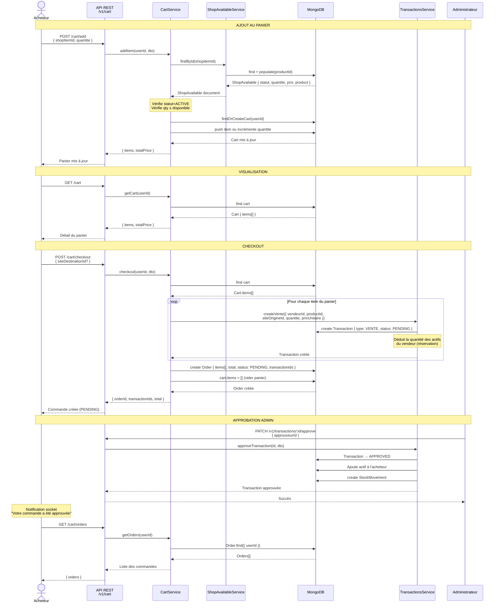

# Flux du système Panier / Achat

## Diagramme de séquence



---

## Explication du flux

### 1. Ajout au panier (`POST /cart/add`)

L'acheteur parcourt la boutique (`GET /shop-items`) et choisit un article.

- Il envoie l'ID du `ShopAvailable` et la quantité souhaitée
- Le `CartService` vérifie via `ShopAvailableService` que l'annonce est **ACTIVE** et que la quantité demandée ≤ quantité disponible
- Si l'article est déjà dans le panier, la quantité est **incrémentée**
- Sinon, un nouvel item est ajouté avec le prix et les infos produit **snapshotés** au moment de l'ajout

### 2. Visualisation (`GET /cart`)

Retourne le panier avec le **total calculé** (prix × quantité pour chaque item).

### 3. Checkout (`POST /cart/checkout`)

Étape clé qui transforme le panier en commande ferme :

- **Pour chaque item** du panier, une **Transaction VENTE** est créée via le module `TransactionsService.createVente()`
  - Le statut de la transaction est **PENDING**
  - La quantité est **réservée** chez le vendeur (son actif est diminué)
  - Une notification socket est envoyée au vendeur et à l'admin
- Une **Order** est créée avec le snapshot des items, le total, et les IDs des transactions
- Le **panier est vidé**

**Cas d'erreur** : Si une transaction échoue (ex : stock plus disponible), les autres sont tout de même créées. La réponse indique un succès partiel avec la liste des erreurs.

### 4. Approbation admin (`PATCH /v1/transactions/:id/approve`)

Chaque transaction PENDING doit être **approuvée par un administrateur** :

- Le statut passe à **APPROVED**
- L'actif est **créé/incrémenté** chez l'acheteur
- Un **StockMovement** est enregistré (traçabilité)
- L'acheteur reçoit une **notification socket** : "Votre commande a été approuvée"

### 5. Historique (`GET /cart/orders` et `GET /cart/orders/:orderId`)

L'acheteur peut consulter ses commandes passées et leur statut. Le statut de l'Order reflète l'état d'ensemble :
- **PENDING** : en attente d'approbation
- **APPROVED** : toutes les transactions approuvées
- **REJECTED** : une transaction rejetée
- **CANCELLED** : commande annulée

---

## Architecture des données

```
Cart (1 par user)
├── userId: ObjectId
└── items: [CartItem]
      ├── shopItemId → ShopAvailable
      ├── productId  → Product
      ├── vendeurId  → User (seller)
      ├── siteId     → Site
      ├── productName (denormalized)
      ├── productImage (denormalized)
      ├── quantite
      ├── prixUnitaire
      └── addedAt

Order (1 par checkout)
├── userId → User
├── items: [CartItem] (snapshot)
├── total: number
├── status: PENDING | APPROVED | REJECTED | CANCELLED
└── transactionIds: [ObjectId → Transaction]

Transaction (VENTE)
├── type: VENTE
├── status: PENDING → APPROVED
├── initiatorId → User (buyer)
├── recipientId → User (seller)
├── productId → Product
├── quantite
├── prixUnitaire
└── siteOrigineId → Site
```

## Dépendances entre modules

```
CartModule
├── ShopAvailableModule  → vérification disponibilité + prix
└── TransactionsModule   → création des transactions VENTE au checkout
```
